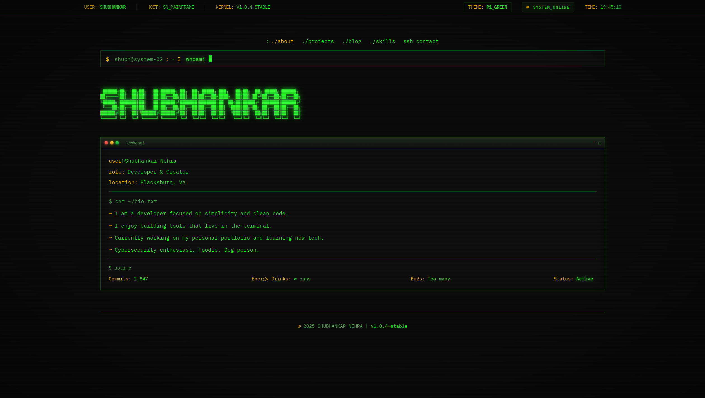

# NEHRA_OS v1.0 | Terminal Portfolio

A retro-futuristic, terminal-themed developer portfolio built with React, TypeScript, and Tailwind CSS. It features a fully functional CLI (Command Line Interface), multiple color themes (Phosphor Green, Amber, Cyan), and authentic CRT monitor effects.



## 🖥️ Features

* **Immersive Terminal Experience:** Functional command line with typing animations.
* **CRT Aesthetics:** Custom CSS scanlines, screen flicker, and text glow effects.
* **Theme Management:**
    * `P1_GREEN` (Classic Retro)
    * `P2_CYAN` (Cyber / Future)
    * `P3_AMBER` (Eye-Care / Low Blue Light)
* **System Awareness:**
    * Live clock locked to system clock.
    * Dynamic Status: "SLEEPING" (10 PM - 6 AM) vs "ONLINE".
* **Responsive:** Fully optimized for large 4K monitors down to mobile screens.

## 🛠️ Tech Stack

* **Core:** React 18, TypeScript, Vite
* **Styling:** Tailwind CSS, Custom CSS Variables
* **Routing:** React Router DOM
* **Deployment:** Vercel

## 🤖 AI Transparency

**Note on Development:**
This project was built with the assistance of Artificial Intelligence.
* **Concept & Architecture:** Designed by Shubhankar Nehra.
* **Code Generation:** AI was used to accelerate the writing of boilerplate code, complex CSS animations (scanlines/glows), and TypeScript interfaces.
* **Debugging:** AI served as a pair programmer for troubleshooting and logic.

I believe in transparency regarding the tools used in my workflow. While AI helped build the ship, I am the captain who steered it.

## 🚀 Getting Started

1.  **Clone the repository:**
    ```bash
    git clone [https://github.com/nehrashubh/my_portfolio.git](https://github.com/nehrashubh/my_portfolio.git)
    cd my_portfolio
    ```

2.  **Install dependencies:**
    ```bash
    npm install
    ```

3.  **Run locally:**
    ```bash
    npm run dev
    ```

## 📄 License

This project is open source and available under the [MIT License](LICENSE).

---
*© 2025 Shubhankar Nehra*
